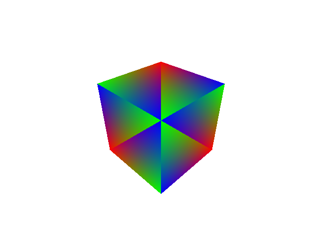

# Ray Tracing

## Description
This test create a scene with single cube (single TLAS containing single BLAS).
This is the most primitive ray tracing test with ray query. This application is
implemented using a compute shader, where the output color displays the barycentric
coordinate of the pixel within the intersected triangle.

## Reference

